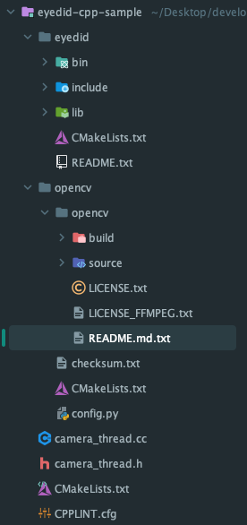
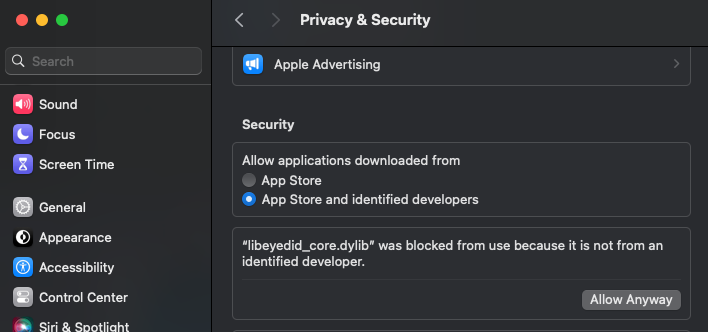

<p align="center">
    
</p>
<div align="center">
    <h1>Eyedid SDK Cpp Sample(C++)</h1>
    <a href="https://github.com/visualcamp/eyedid-cpp-sample/releases" alt="release">
        
    </a>
</div>

## Releases
See [Release](https://github.com/visualcamp/eyedid-cpp-sample/releases)

## Sample Demo Requirements
* [Eyedid Cpp SDK][eyedid-manage]
* Must be issued a license key in [Eyedid Console][eyedid-manage]
* Windows or Mac
* C++ 11 or higher
* [CMake](https://cmake.org/download/) 3.5 or higher
* [OpenCV](https://opencv.org/releases/)

Notes
* Visual Studio 2015 or below is not tested. 

## Build
### Windows
1. Sign in to [manage.eyedid.ai][eyedid-manage] and download Eyedid Cpp SDK from [Eyedid console page][eyedid-manage]
2. Copy the `eyedid` folder to this project.
3. Get a license key from [Eyedid console page][eyedid-manage] and copy your key to `main.cpp`
   ```
   // authenticate
   const char* license_key = "PUT YOUR LICENSE KEY HERE"; // paste your key here
   ```
4.  Download OpenCV Windows library from https://opencv.org/releases/ 
5.   (Only Windows) Copy the extracted `opencv` into this project's [`opencv` directory](opencv/)   
    By now, the project structure should be like below  
    
6. Build the project with CMake
    * You can load a CMake project with IDEs, such as CLion or Visual Studio
    * Or you can build with command line  
    ```shell
    cmake -B build -DCMAKE_BUILD_TYPE=Release
    cmake --build build --config Release
    ```
    * vcpkg is not supported yet. If you want to build with Visual Studio project instead of CMake,
      you have to manually implement the source codes and third party libraries.
### MacOs
1. Sign in to [manage.eyedid.ai][eyedid-manage] and download Eyedid Cpp SDK from [Eyedid console page][eyedid-manage].
2. Copy the `eyedid` folder to this project.
3. Get a license key from [Eyedid console page][eyedid-manage] and copy your key to `main.cpp`:
   ```cpp
   // authenticate
   const char* license_key = "PUT YOUR LICENSE KEY HERE"; // paste your key here
   ```
4. Install OpenCV using Homebrew:
   ```shell
   brew install opencv
   ```
   This command will install the latest version of OpenCV along with its dependencies.

5. Set environment variables to ensure your project can find the OpenCV headers and libraries. Depending on the shell you are using (`bash` or `zsh`), update your shell profile (`~/.bash_profile` for bash or `~/.zshrc` for zsh):

   ```shell
   # Add the following lines to your shell profile
   echo 'export PATH="/usr/local/opt/opencv/bin:$PATH"' >> ~/.bash_profile
   echo 'export PKG_CONFIG_PATH="/usr/local/opt/opencv/lib/pkgconfig:$PKG_CONFIG_PATH"' >> ~/.bash_profile
   echo 'export LDFLAGS="-L/usr/local/opt/opencv/lib"' >> ~/.bash_profile
   echo 'export CPPFLAGS="-I/usr/local/opt/opencv/include"' >> ~/.bash_profile

   # Load the updated environment variables
   source ~/.bash_profile
   ```

   If you are using `zsh` (which is the default shell on newer macOS versions):

   ```shell
   echo 'export PATH="/usr/local/opt/opencv/bin:$PATH"' >> ~/.zshrc
   echo 'export PKG_CONFIG_PATH="/usr/local/opt/opencv/lib/pkgconfig:$PKG_CONFIG_PATH"' >> ~/.zshrc
   echo 'export LDFLAGS="-L/usr/local/opt/opencv/lib"' >> ~/.zshrc
   echo 'export CPPFLAGS="-I/usr/local/opt/opencv/include"' >> ~/.zshrc

   # Load the updated environment variables
   source ~/.zshrc
   ```

   These commands ensure that the compiler and linker can find OpenCV when building your C++ project.

6. Build the project with CMake:
    * You can load a CMake project with IDEs, such as CLion or Visual Studio.
    * Or you can build with command line:
      ```shell
      cmake -B build -DCMAKE_BUILD_TYPE=Release
      cmake --build build --config Release
      ```
    * Note: vcpkg is not supported yet. If you want to build with a Visual Studio project instead of CMake, you have to manually configure the source codes and third-party libraries.
      
If you have any problems, feel free to [contact us](https://sdk.eyedid.ai/contact-us) 

[eyedid-manage]: https://manage.eyedid.ai/

## How to Allow `libeyedid_core.dylib` on macOS

When running an application that links against the `libeyedid_core.dylib` library on macOS, you may need to adjust your security settings to allow its execution. Follow the steps below to enable and use `libeyedid_core.dylib`:

### 1. Error Message Upon Application Launch

When you run an application that uses `libeyedid_core.dylib`, you might see the following error message:

“libeyedid_core.dylib” was blocked from use because it is not from an identified developer.

### 2. Open System Preferences

- After seeing the error message, open **System Preferences** on your Mac.
- You can open **System Preferences** by clicking the Apple logo in the top-left corner of your screen and selecting "System Preferences" from the dropdown menu.

### 3. Navigate to Security & Privacy Settings

- In System Preferences, click on the **Privacy & Security** (or "Security & Privacy") icon.

### 4. Allow the Blocked Library

- Scroll down to the **"Allow applications downloaded from"** section in the **Privacy & Security** panel.
- You should see a message stating that `libeyedid_core.dylib` was blocked.
- Click the **"Allow Anyway"** button to permit the execution of `libeyedid_core.dylib`.



### 5. Relaunch the Application

- After clicking "Allow Anyway," relaunch the application. You should now be able to use `libeyedid_core.dylib` without issues.

### Important Notes

- This process is specific to macOS. Only allow `libeyedid_core.dylib` if it is from a trusted source.
- After allowing the library, ensure that the application functions as expected.


## License Information

### SDK License
All rights to the Eyedid Cpp SDK are owned by VisualCamp. Unauthorized copying, modification, distribution, or any other form of use is strictly prohibited unless explicitly authorized by VisualCamp. Please refer to the license agreement provided with the SDK for more details.

### Sample Project License
The sample project provided with the Eyedid Cpp SDK is licensed under the MIT License. You are free to use, modify, and distribute this sample project, provided that the original copyright and permission notice are included in all copies or substantial portions of the software.
